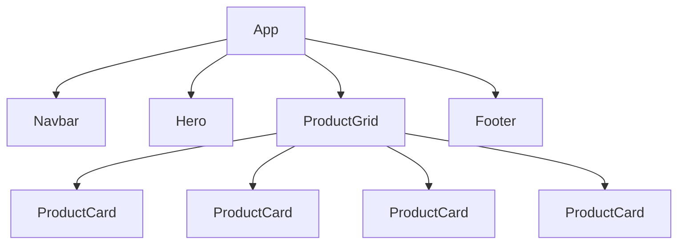

# Component Tree — ShopVN

## 1. Sơ đồ cây component

```text
App
├── Navbar
│   └── links[]
├── Hero
├── ProductGrid
│   ├── ProductCard
│   ├── ProductCard
│   ├── ProductCard
│   └── ProductCard
└── Footer
```

Hoặc Mermaid:



## 2. Props mỗi component cần

| Component | Props | Ý nghĩa |
|----------|-------|---------|
| `Navbar` | `logo`, `links` | Hiển thị logo và danh sách link điều hướng |
| `Hero` | `title`, `subtitle`, `buttonText` | Hiển thị hero section |
| `ProductGrid` | `title`, `products` | Hiển thị tiêu đề và danh sách sản phẩm |
| `ProductCard` | `image`, `name`, `price` | Hiển thị một sản phẩm |
| `Footer` | `text` | Hiển thị nội dung chân trang |

## 3. Vì sao tách component?

- `Navbar`: dùng lại ở nhiều trang.
- `Hero`: có thể thay title/subtitle theo từng landing page.
- `ProductGrid`: quản lý layout danh sách sản phẩm.
- `ProductCard`: lặp lại nhiều lần, sửa một chỗ áp dụng cho tất cả card.
- `Footer`: dùng lại ở toàn bộ website.
- `App`: chỉ compose component, code gọn và dễ bảo trì hơn.

## 4. Component nào nhận props?

Tất cả component con đều nhận props:

```text
Navbar      ← logo, links
Hero        ← title, subtitle, buttonText
ProductGrid ← title, products
ProductCard ← image, name, price
Footer      ← text
```

## 5. Component nào lồng trong component nào?

`ProductCard` lồng trong `ProductGrid`.  
Các component `Navbar`, `Hero`, `ProductGrid`, `Footer` lồng trực tiếp trong `App`.
